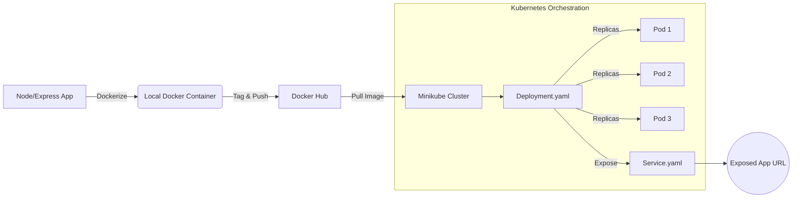

Here is the updated documentation including the diagrammatic representation. You can copy this block directly into your Markdown file.

---

# Node.js Kubernetes Deployment Workflow

This document outlines the CI/CD and deployment pipeline for containerizing a Node.js/Express application and deploying it to a Kubernetes cluster using Minikube.

## Architectural Workflow

The following flowchart illustrates the transition from a local Node.js application to a scaled, Kubernetes-managed service.

## Workflow Phases

### 1. Containerization

- **Source Application:** Node.js/Express.
- **Dockerization:** The application is packaged into a container image.
- **Local Validation:** The image is tested by running it in a local container environment before proceeding to the registry.

### 2. Image Management

- **Registry:** The finalized image is tagged with a version and pushed to **Docker Hub**.
- **Purpose:** This central repository serves as the source of truth for the Kubernetes cluster to pull images during deployment.

### 3. Kubernetes Orchestration (Minikube)

- **Environment:** Minikube is used to simulate a local Kubernetes cluster for development and staging.
- **Configuration Files:**
  - `deployment.yaml`: Defines the desired state, including the image source and replica count.
  - `service.yaml`: Manages the networking layer to expose the application to traffic.
- **Execution:**
  - The deployment pulls the image from Docker Hub.
  - Kubernetes orchestrates the pods, scaling the application (e.g., running 3 pods for high availability).
  - The `Service` object exposes the deployment internally or externally.

### 4. Application Exposure

- **Final Output:** The application is accessible via an exposed URL, providing a stable endpoint for users to interact with the Node.js service running on the K8s cluster.

---

## Technical Summary

| Stage                | Tool/Technology           |
| :------------------- | :------------------------ |
| **Runtime**          | Node.js / Express         |
| **Container Engine** | Docker                    |
| **Registry**         | Docker Hub                |
| **Orchestration**    | Kubernetes (Minikube)     |
| **Configuration**    | YAML (Deployment/Service) |

---
